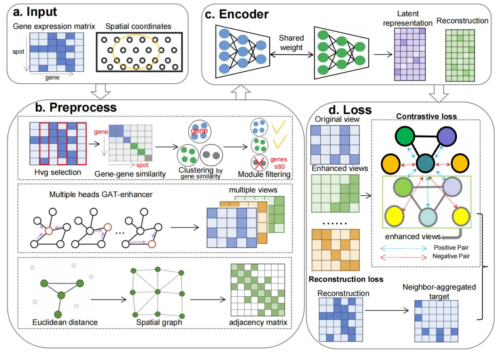

# stCOMET：Co-expression Module-Enhanced Multi-view Contrastive Learning for Spatial Domain Identification in Spatial Transcriptomics
# Overview
Spatial transcriptomics measures gene expression while preserving tissue coordinates, and spatial domain identification—partitioning tissue into regions with coherent transcriptional programs—has become a foundational task for downstream analyses such as spatially resolved differential expression and cell–cell communication inference. However, current methods face two key limitations: at the feature level, highly variable gene sets are used without co-expression-based refinement, allowing noisy or isolated genes to degrade learned representations; at the representation level, embeddings are typically learned from a single spatial graph view, offering no explicit guarantee of stability under graph perturbation. To address these gaps, we present stCOMET, a spatial representation learning framework that couples co-expression-guided gene selection—which retains only genes belonging to coherent co-expression modules—with graph-based multi-view augmentation and a neighbourhood-aware contrastive objective that enforces representation consistency across complementary spatial views. Across 12 human dorsolateral prefrontal cortex sections and five MERFISH hypothalamic sections, stCOMET achieved the best average performance among eight evaluated methods, as measured by adjusted Rand index, normalized mutual information, completeness and homogeneity. stCOMET further identified a periventricular-region-associated MERFISH domain whose marker genes were enriched for neuropeptide signalling and hormone secretion, demonstrating the biological interpretability of the inferred spatial organization. These results establish stCOMET as a robust and interpretable framework for spatial domain identification across sequencing- and imaging-based spatial transcriptomics platforms.

<p align="center">
  
</p>

## Requirements 要求

Core package versions used in the project environment are listed below.

项目中使用的核心软件包版本如下所示。

```text
python>=3.10
anndata==0.11.4
scanpy==1.11.5
squidpy==1.6.5
numpy==1.26.4
pandas==2.3.3
scipy==1.15.3
scikit-learn==1.7.2
scikit-image==0.25.2
scikit-misc==0.5.2
matplotlib==3.10.8
seaborn==0.13.2
networkx==3.4.2
umap-learn==0.5.11
faiss-gpu==1.7.2
h5py==3.16.0
spatialdata==0.5.0
zarr==2.18.3
torch==2.5.0+cu124
torchvision==0.20.0+cu124
torchaudio==2.5.0+cu124
torch-geometric==2.7.0
torch-scatter==2.1.2+pt25cu124
torch-sparse==0.6.18+pt25cu124
tqdm==4.67.3
```

Install the Python dependencies with:

使用以下命令安装 Python 所需的依赖项：

```bash
pip install -r requirements.txt
```
## Tutorial
For the step-by-step tutorial, please refer to: https://stcomet.readthedocs.io/en/latest/tutorial.html

## Compared Methods

The following state-of-the-art methods were used for performance benchmarking:

- [SpatialPCA](https://www.nature.com/articles/s41467-022-34879-1)
- [SpaGCN](https://www.nature.com/articles/s41592-021-01255-8)
- [CCST](https://www.nature.com/articles/s43588-022-00266-5)
- [conST](https://doi.org/10.1101/2022.01.14.476408)
- [DeepST](https://academic.oup.com/nar/article/50/22/e131/6761985)
- [STAGATE](https://www.nature.com/articles/s41467-022-29439-6)
- [GraphST](https://www.nature.com/articles/s41467-023-36796-3)
